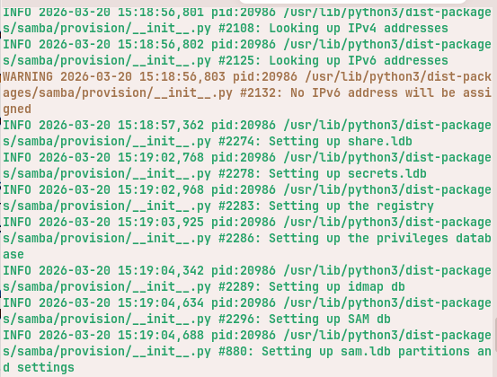
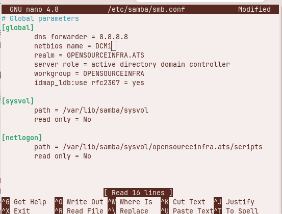

# OpenDomaineControl

Nous allons configurer Active Directory et un Contrôleur de Domaine sous Ubuntu Server 20 avec Samba DC.

Configurer Samba comme contrôleur de domaine est une alternative très sérieuse et logique à celui de Windows Server et son Active Directory, car le Contrôleur de Domaine Samba peut intégrer des clients Windows (7/10/11) comme le ferait si bien celui de Windows Server. D'après le wiki de Samba, il fonctionne au niveau fonctionnel forestier de Windows Server 2008 R2, suffisant pour gérer des entreprises sophistiquées et répond aux exigences strictes de conformité comme le NIST 800-171 par exemple.

Ce travail est une des sections d'un projet (Lab) OpenSourceInfra.

Le but principal est de concevoir une infrastructure complète et fonctionnelle basée sur des outils open source afin d'offrir une alternative réelle et performante aux outils propriétaires. Le Lab sera régulièrement mis à jour et devra respecter certaines normes, règles et critères de conformité en matière de sécurité afin que cette architecture soit adaptable à un environnement de production.

## Installation et configuration

### Installation

Nous allons configurer premièrement le nom d'hôte, nous allons choisir "dcm1".

```bash
sudo hostnamectl set-hostname dcm1
```

Éditer le fichier /etc/hosts, cela n'est pas obligatoire dans l'immédiat. De ce fait, nous allons automatiser cette tâche avec un script et un cron à chaque démarrage du serveur.

```bash
sudo nano /etc/hosts
```

Entrer la ligne suivante :

```text
ip_du_serveur     dcm1.opensourceinfra.ats dcm1
```

Installation de Samba DC (dans notre cas, nous travaillerons avec Ubuntu Server 20.04 LTS).

```bash
sudo apt install samba smbclient winbind libpam-winbind libnss-winbind krb5-kdc libpam-krb5 -y
```

Répondre aux questions, valider toutes les questions par Entrée. Nous compléterons ces champs lorsque nous allons promouvoir AD.

## Configurer Samba comme contrôleur AD

Copie des anciennes configurations avant de passer aux configurations :

```bash
sudo cp /etc/samba/smb.conf /etc/samba/smb.conf.bak
sudo cp /etc/krb5.conf /etc/krb5.conf.bak
```

Suppression des anciennes configurations :

```bash
sudo systemctl stop smbd nmbd winbind
sudo rm -rf /var/lib/samba/*
sudo rm -rf /etc/samba/smb.conf
```

Promouvoir Samba DC :

En mode interactif :

```bash
sudo samba-tool domain provision --use-rfc2307 --interactive
```

Nous allons préférer le mode non interactif :

```bash
samba-tool domain provision --server-role=dc --use-rfc2307 --dns-backend=SAMBA_INTERNAL --realm=OPENSOURCEINFRA.ATS --domain=OPENSOURCEINFRA --adminpass='P@ssw0rd@'
```



Définir dans /etc/samba/smb.conf le DNS forwarder dans la section [global] par 8.8.8.8 ou 1.1.1.1 ou encore IP du serveur DNS.



Pour démarrer Samba au démarrage du serveur :

```bash
sudo systemctl unmask samba-ad-dc
sudo systemctl enable samba-ad-dc
sudo systemctl start samba-ad-dc
```

Éditer et désactiver systemd-resolved pour éviter qu'il écrase resolv.conf :

Éditer dans le fichier /etc/resolv.conf :

```text
nameserver 192.168.1.93
search OPENSOURCEINFRA
```

Désactiver :

```bash
sudo systemctl disable systemd-resolved
sudo systemctl stop systemd-resolved
```

```bash
sudo cp /var/lib/samba/private/krb5.conf /etc
```

Testons la configuration.

L'enregistrement SRV _ldap :

```bash
host -t SRV _ldap._tcp.opensourceinfra.ats
```

L'enregistrement de ressource SRV _kerberos basé sur UDP dans le domaine :

```bash
host -t SRV _kerberos._udp.opensourceinfra.ats
host -t A dcm1.opensourceinfra.ats
```

## Kerberos

```bash
kinit administrator@OPENSOURCEINFRA.ATS
```

Résultat :

```text
Password for administrator@OPENSOURCEINFRA.ATS:
Warning: Your password will expire in 41 days on Fri May 1 15:19:13 2026
```

```bash
klist
```

Résultat :

```text
Ticket cache: FILE:/tmp/krb5cc_1000
Default principal: administrator@OPENSOURCEINFRA.ATS

Valid starting     Expires            Service principal
03/20/26 15:53:54  03/21/26 01:53:54  krbtgt/OPENSOURCEINFRA.ATS@OPENSOURCEINFRA.ATS
renew until 03/21/26 15:53:27
```

Créons le compte administrateur du domaine :

```bash
kinit Administrator
```

Testons la connectivité avec le compte administrator :

```bash
smbclient //localhost/netlogon -UAdministrator -c 'ls'
```

Créons un compte utilisateur simple :

- Créer l'utilisateur en mode interactif :

```bash
sudo samba-tool user create username
```

- Créer avec mot de passe directement :

```bash
sudo samba-tool user create tchamie Passw0rd123@
```